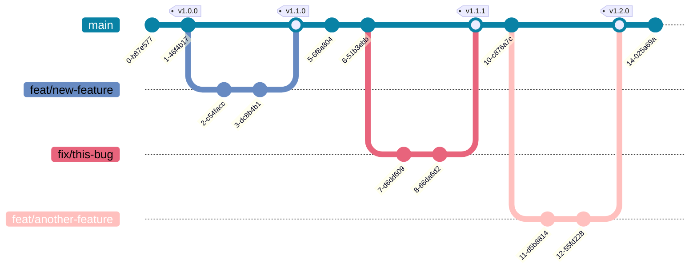

# Git workflow

---

## Overview



## Branches

Git branches should have a meaningful name that reflects the purpose of the branch. It **can** follow the `type/description` pattern for readability but it is not a obligation.

The stable source code is hosted on `main` branch.

Here are some examples for other types of branches:

- `feat/<feature_name>`
- `fix/<bug_name>`
- `chore/<task_name>`
- `docs/<documentation_name>`

## Commits

The commit message must follow the [Conventional Commits](https://www.conventionalcommits.org/en/v1.0.0/) format.

Format of the commit message:

```raw
<type>(<scope>): <subject>
```

The type and scope should always be lowercase as shown below.

**Allowed `<type>` values**:

* `feat` for a new feature for the user, not a new feature for build script. Such commit will trigger a release bumping a MINOR version.
* `fix` for a bug fix for the user, not a fix to a build script. Such commit will trigger a release bumping a PATCH version.
* `perf` for performance improvements. Such commit will trigger a release bumping a PATCH version.
* `docs` for changes to the documentation.
* `style` for formatting changes, missing semicolons, etc.
* `refactor` for refactoring production code, e.g. renaming a variable.
* `test` for adding missing tests, refactoring tests; no production code change.
* `build` for updating build configuration, development tools or other changes irrelevant to the user.
* `chore` for updates that do not apply to the above, such as dependency updates.
* `ci` for changes to CI configuration files and scripts
* `revert` for revert to a previous commit

**Allowed `<scope>` values**:

Scope is not restricted to a predefined list of values. It must reflect the part of the codebase that is being changed.

**Breaking changes**:

A commit introducing a breaking API change needs to append a ! after the type/scope.

## Tags

The Tag is a way to identified a version and ensure that the related code is stable and deserve a release. The tag revision must follows the [Semantic Versioning 2.0.0](https://semver.org/) (or SemVer) convention.

Tags must have the following format:

- `v<3-digits_semantic-version>`

Here are some examples:

- `v1.0.0`
- `v1.2.3`
- `v1.0.0-alpha.1`

The SemVer website provides a [Regex101 Online Validator](https://regex101.com/r/Ly7O1x/3/) to check the compliance of the version.
